Container image for iPerf3 - a tool for active measurements of the maximum achievable bandwidth on IP networks.

## Usage

### Run server

```shell
docker run --rm -it --network=host ghcr.io/r-xs-fi/iperf3 
```

Outputs:
```console
-----------------------------------------------------------
Server listening on 5201 (test #1)
-----------------------------------------------------------
```
### Run client

```shell
docker run --rm -it --network=host ghcr.io/r-xs-fi/iperf3 --client 127.0.0.1
```

Outputs:
```console
Connecting to host 127.0.0.1, port 5201
[  5] local 127.0.0.1 port 48436 connected to 127.0.0.1 port 5201
[ ID] Interval           Transfer     Bitrate         Retr  Cwnd
[  5]   0.00-1.00   sec  10.2 GBytes  87.7 Gbits/sec    0   1.62 MBytes
```

## Supported platforms


| OS    | Architecture  | Supported | Example hardware |
|-------|---------------|-----------|-------------|
| Linux | amd64 | ✅       | Regular PCs (also known as x64-64) |
| Linux | arm64 | ✅       | Raspberry Pi with 64-bit OS, other single-board computers, Apple M1 etc. |
| Linux | arm/v7 | ✅       | Raspberry Pi with 32-bit OS, older phones |
| Linux | riscv64 | ✅       | More exotic hardware |

## How does this software get to me?

```mermaid
flowchart TD
    subgraph "Origin"
        sourcerepo["Original source repo"]
    end
    subgraph "Alpine infrastructure"
        Alpine_build[Alpine build machine]
        Alpine_package[Alpine package registry: iperf3 🔗]

        click Alpine_package "https://pkgs.alpinelinux.org/package/edge/community/x86/iperf3"
    end
    subgraph "Packaging build"
        rxsfi_build["r.xs.fi build (GitHub Actions)"]
    end
    subgraph "Container Registry"
        r_xs_fi_package_registry[ghcr.io/r-xs-fi/iperf3 🔗]

        click r_xs_fi_package_registry "https://ghcr.io/r-xs-fi/iperf3"
    end
    subgraph "user"
        docker_run[$ docker run ...]
    end
    sourcerepo -- downloads --> Alpine_build -- stores --> Alpine_package
    Alpine_package -- download --> rxsfi_build
    rxsfi_build -- push --> r_xs_fi_package_registry
    r_xs_fi_package_registry -- pull --> docker_run[$ docker run ...]

```


